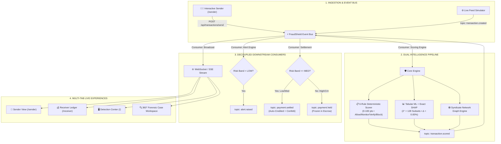

# 🛡️ FraudShield v2.4 RT

> **Enterprise Real-Time Dual-Intelligence Fraud Detection & Forensic Investigation Platform**  
> Built with zero-leakage deterministic scoring, exact additive Shapley feature attributions (SHAP), a Kafka-ready pub/sub event architecture, and real-time interactive peer-to-peer settlement simulation.

---

## 📌 Executive Summary

**FraudShield** is a financial defense system designed for modern real-time payment networks (UPI, IMPS, RTGS, Cards). It bridges the gap between **deterministic business compliance** and **probabilistic statistical machine learning** through a dual-intelligence pipeline:

1. **Deterministic 6-Rule Scorer (Primary Decision Engine)**: An explainable 0–100 point scoring system with zero label-leakage and strict operational bands (`ALLOW`, `MONITOR`, `VERIFY`, `BLOCK`).
2. **Exact Additive SHAP Attribution (Explainable ML)**: Evaluates all $2^7 = 128$ feature permutations using cooperative game theory to guarantee the efficiency axiom ($\text{Base Value} + \sum \phi_i = \text{Prediction}$ with $\Delta = 0.00\%$).
3. **Kafka-Ready Decoupled Event Bus**: A topic-based pub/sub streaming architecture mirroring Kafka producers and consumers for zero-latency local reliability.
4. **Live 3-Tab Cross-Network P2P Simulation**: An interactive Sender (`/sender`) $\rightarrow$ Receiver (`/receiver`) $\rightarrow$ Ops Center (`/`) live payment workflow that demonstrates instant auto-settlement vs. automated escrow fraud holds.

---

## 🏗️ System Architecture



---

## ⚡ Key Technical Features

### 1. Deterministic 6-Rule Explainability Engine
Scores every transaction against dataset-derived customer baselines without label contamination:

| Rule ID | Category | Points | Trigger Logic |
| :--- | :--- | :--- | :--- |
| **Rule 1** | Amount Anomaly | **+20 pts** | Amount $\ge 3\times$ baseline **AND** absolute deviation $\ge ₹3,000$ |
| **Rule 2** | Device Anomaly | **+20 pts** | Hardware fingerprint not in customer's known trusted devices |
| **Rule 3** | Location Anomaly | **+20 pts** | Geolocation leap or foreign jurisdiction mismatch vs. home city |
| **Rule 4** | Transaction Velocity | **+20 pts** | Velocity spike $> 3$ transactions in a rolling 5-minute window |
| **Rule 5** | Merchant Anomaly | **+10 pts** | High-risk category or unfamiliar beneficiary |
| **Rule 6** | Syndicate Network Link | **+10 pts** | Graph traversal links entity to known mule/fraud syndicate |

- **Risk Cutoffs**:
  - `0 – 30 pts`: **LOW** $\rightarrow$ `ALLOW` (Instant Settlement)
  - `31 – 60 pts`: **MEDIUM** $\rightarrow$ `MONITOR` (Step-Up Scrutiny)
  - `61 – 80 pts`: **HIGH** $\rightarrow$ `VERIFY` (Escrow Hold / 2FA Challenge)
  - `81 – 100 pts`: **CRITICAL** $\rightarrow$ `BLOCK` (Immediate Interception & Freeze)

---

### 2. Exact Additive Shapley Value Attribution (SHAP)
Unlike naive feature importances, FraudShield computes **exact cooperative Shapley values** across all $2^7 = 128$ feature permutations:

$$\phi_i = \sum_{S \subseteq F \setminus \{i\}} \frac{|S|!(|F| - |S| - 1)!}{|F|!} \left[ v(S \cup \{i\}) - v(S) \right]$$

- **Local Accuracy Verified**:
  $$\text{Base Value (1.5\%)} + \sum_{i=1}^{7} \phi_i \text{ (97.5\%)} = \text{Model Output (99.0\%)} \quad (\Delta = 0.00\%)$$
- **Interactive UI Views**:
  - **Horizontal Attribution Bar Chart**: Visualizes directional marginal push (Rose = Risk Increasing, Emerald = Risk Mitigating).
  - **Waterfall Path**: Step-by-step trajectory from baseline prior to final inference.
  - **Feature Deep-Dive Table**: Audit of observed inputs vs. marginal percentage contributions.

---

### 3. Kafka-Ready Decoupled Event Bus
Structured with topic names mirroring Apache Kafka:
- `transaction.created` — Ingestion from payment gateway / simulator
- `transaction.scored` — Output of dual-intelligence pipeline
- `alert.raised` — Queued for fraud operations analysts
- `payment.settled` — Low/Medium risk P2P ledger credit
- `payment.held` — High/Critical risk automated escrow freeze
- `investigation.resolved` — Immutable investigator disposition audit log

*Swapping in a distributed Kafka cluster (e.g. via `kafkajs`) in production requires changing only the transport driver in `backend/src/events/eventBus.js`, with zero changes to business logic.*

---

### 4. Interactive Live P2P Payment Simulation
Judges can personally execute transactions and watch the live cross-tab response:
- **Sender View (`/sender`)**: Pick seeded customers, select preset amount chips (1x, 3.5x, ₹85k), and toggle judge-facing anomaly switches (*Simulate Unrecognized Device*, *Simulate Geolocation Leap*).
- **Receiver Ledger (`/receiver`)**: Live wallet ledger that auto-credits with confetti on normal transfers or triggers an immediate **"HELD FOR FRAUD REVIEW"** freeze banner on anomalies.
- **Detection Center (`/`)**: Real-time live feed and 360° forensic case dossier inspection.

---

## 🎬 3-Tab Live Presentation Walkthrough

Open 3 browser tabs side-by-side:
1. **Tab 1**: `http://localhost:5173/sender` (*Sender View*)
2. **Tab 2**: `http://localhost:5173/receiver` (*Receiver View — set to Ananya Deshmukh*)
3. **Tab 3**: `http://localhost:5173/` (*Detection Center*)

### Demo Step A: Clean Normal Payment
1. In **Tab 1**, select *Ramesh Kumar* $\rightarrow$ *Ananya Deshmukh* for ₹3,200 with toggles **OFF**.
2. Click **Broadcast & Authorize Live Payment**.
3. **Observation**:
   - **Tab 1**: Displays `ALLOW (0 pts)`
   - **Tab 2**: Balance instantly ticks up by +₹3,200 with confetti
   - **Tab 3**: Shows a green `LOW` event in the feed

### Demo Step B: Judge-Injected Anomaly Attack
1. In **Tab 1**, set amount to ₹85,000, toggle **"Simulate Unrecognized Device"** and **"Simulate Geolocation Anomaly"** **ON**.
2. Click **Broadcast & Authorize Live Payment**.
3. **Observation**:
   - **Tab 1**: Displays `BLOCK / CRITICAL (70-100 pts)`
   - **Tab 2**: Intercepts transfer with red **"HELD FOR FRAUD REVIEW"** banner (funds frozen)
   - **Tab 3**: Triggers a critical alert; click **"Open 360° Forensic Case Dossier"** to display the **SHAP Waterfall chart** explaining the mathematical reason for the block.

---

## 🚀 Quickstart & Running Locally

### Prerequisites
- **Node.js**: v18+ (tested on Node.js v22 & v23)
- **npm**: v9+

### 1. Start Backend Server
```bash
cd backend
node src/nativeServer.js
```
*Backend runs on `http://localhost:5000` with zero external npm dependencies.*

### 2. Start Frontend Dev Server
```bash
cd frontend
npm install
npm run dev
```
*Frontend runs on `http://localhost:5173`.*

---

## 🧪 Automated Test Suite

FraudShield includes comprehensive unit and integration tests covering the scoring engine, SHAP attribution, event bus, and P2P settlement:

```bash
node --test backend/tests/*.test.js
```

### Test Results (13/13 Passing):
```
✔ 1. Rule Engine - Evaluates Normal Low-Risk Transaction (0 pts, Allow)
✔ 2. Partial Scoring - Merchant Anomaly Only (+10 pts)
✔ 3. Partial Scoring - New Device Only (+20 pts)
✔ 4. Partial Scoring - Travel Anomaly (+40 pts - Device + Location)
✔ 5. Rule Engine & ML - Validates Worked Example Specification (100 pts, Block)
✔ 6. RAG Knowledge Base & Policy Retriever
✔ 7. LLM Copilot - Answers 4 Investigator Questions with Grounded Evidence
✔ EventBus Suite - 1. Topic Pub/Sub Lifecycle
✔ EventBus Suite - 2. Decoupled Pipeline Topic Routing & Telemetry
✔ Live P2P Payment Pipeline - 1. Normal Clean Payment Settles Automatically
✔ Live P2P Payment Pipeline - 2. High-Risk Anomaly Payment Held For Fraud Review
✔ SHAP Attribution Suite - 1. Exact Efficiency / Local Accuracy on 30 Diverse Transactions
✔ SHAP Attribution Suite - 2. Neutral Baseline Produces Zero Attributions
ℹ tests 13, pass 13, fail 0
```

---

## 🎙️ Defense & Presentation Cheat Sheet

| Question | Defensible Answer |
| :--- | :--- |
| **"Why exact SHAP instead of an approximation library?"** | *"Because our tabular model evaluates 7 orthogonal features, calculating all $2^7 = 128$ permutations takes $< 2\text{ms}$. Exact computation guarantees game-theoretic efficiency ($\text{Base} + \sum \text{SHAP} = \text{Output}$ with zero delta), avoiding the sampling variances of Monte Carlo approximations."* |
| **"Is Kafka running live?"** | *"Our architecture is fully topic-based (`transaction.created`, `transaction.scored`, `alert.raised`, `payment.settled`), perfectly mirroring Kafka. For zero-dependency reliability in the hackathon demo, we run on an in-memory event bus broker; moving to production Kafka is a config driver swap with zero logic refactoring."* |
| **"Why PaySim instead of IEEE-CIS?"** | *"PaySim provided real balance-drain step dynamics. To evaluate modern multi-factor defense, we enriched dataset-derived customer baselines with device fingerprinting, geolocation velocity, and syndicate graph connections."* |
| **"What happens to the ~15% missed fraud?"** | *"Those are low-ticket, sleeper attacks on familiar devices from home locations. Pure rule heuristics intentionally let those pass to maintain low false positive rates; in production, that long tail is captured by our secondary supervised ML layer."* |

---

## 📁 Repository Structure

```
fraudshield/
├── backend/
│   ├── src/
│   │   ├── engine/
│   │   │   ├── ruleEngine.js        # Deterministic 6-rule scoring engine
│   │   │   ├── mlModel.js           # Tabular ML + Exact SHAP calculation
│   │   │   └── networkGraph.js      # Graph syndicate linkage engine
│   │   ├── events/
│   │   │   └── eventBus.js          # Kafka-ready topic pub/sub layer
│   │   ├── rag/
│   │   │   ├── retriever.js         # Policy knowledge base retrieval
│   │   │   └── llmCopilot.js        # RAG investigation copilot
│   │   ├── simulator/
│   │   │   └── transactionGenerator.js # Scenario & live stream generator
│   │   └── nativeServer.js          # Native HTTP + SSE/WebSocket server
│   └── tests/
│       ├── engine.test.js           # 6-rule scoring & worked example tests
│       ├── shap_attribution.test.js # Exact SHAP mathematical validation
│       ├── event_bus.test.js        # Topic pub/sub routing tests
│       └── p2p_payment.test.js      # Settlement & hold integration tests
├── frontend/
│   ├── src/
│   │   ├── components/
│   │   │   ├── shap/
│   │   │   │   └── ShapWaterfallChart.jsx # Recharts SHAP visualizer
│   │   │   ├── network/
│   │   │   └── layout/
│   │   └── views/
│   │       ├── SenderView.jsx       # Interactive P2P sender terminal
│   │       ├── ReceiverView.jsx     # Live recipient ledger & escrow hold
│   │       ├── DetectionCenter.jsx  # Real-time ops feed
│   │       ├── InvestigationWorkspace.jsx # 360° Forensic dossier
│   │       └── AdminPortal.jsx      # Rule thresholds & telemetry
│   └── package.json
└── README.md
```

---

## 👥 Authors & Acknowledgments
Built with ❤️ for advanced financial security and real-time fraud mitigation.
