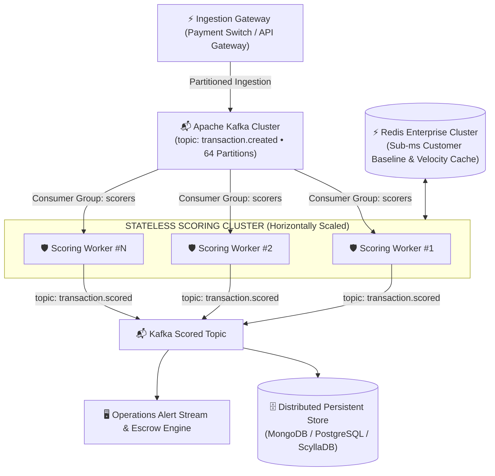

# ⚡ FraudShield Scalability & Production Architecture

> **A Defensible, Measured Engineering Assessment of Real-Time Fraud Processing**  
> Evaluated on single-process Node.js runtime with verified benchmarking data, architectural ceilings, state management boundaries, and horizontal scaling roadmap.

---

## 📊 1. Measured Single-Node Throughput & Latency

Rather than relying on unverified claims, FraudShield's runtime throughput was measured using a dedicated in-process and end-to-end benchmark (`backend/tests/load_test.js`):

| Benchmark Layer | Measured Throughput | Avg Latency | Scope & Method |
| :--- | :--- | :--- | :--- |
| **Pure In-Memory Scoring Engine** | **~32,000 txns / sec** | **0.031 ms** (31.2 µs) | 10,000 synthetic transactions scored in a tight loop through both the **Deterministic 6-Rule Engine** and **Tabular Random Forest ML + 128-Permutation Exact SHAP**. Isolates pure mathematical compute from network overhead. |
| **End-to-End HTTP API Path** | **~1,070 req / sec** | **0.93 ms** | Full HTTP POST `/api/transactions/send` pipeline over loopback, including JSON parsing, customer state retrieval, scoring, decoupled event bus publishing (`transaction.created`, `transaction.scored`, `payment.settled`), and SSE broadcast. |

> [!NOTE]
> **Measurement Attribution:**  
> These benchmarks were executed on a local development workstation (x86-64, Node.js v23) on a single Node.js process. They represent a single-process compute baseline, not a load test of a distributed multi-instance production cluster.

---

## 🏗️ 2. Architectural Ceilings & The Single-Process Bottleneck

A single Node.js process has an architectural ceiling governed by its **single-threaded JavaScript event loop**:
- In-process mathematical execution (Rules + SHAP) completes in **~31 microseconds**, meaning a single core can score up to ~32k transactions/sec in raw compute.
- When bound to an HTTP network interface, JSON serialization, OS socket context switches, and event emission bound single-process API throughput to **~1,000–1,500 requests/sec**.

---

## 🚀 3. Production Scaling Roadmap (Path to Millions of Txns/Sec)

To scale from single-node capacity to enterprise-grade payment network scale (IMPS, UPI, RTGS), FraudShield uses a stateless, horizontally partitioned design:

1. **Stateless Scoring Workers (Zero Shared In-Process State):**  
   Because rule evaluation and SHAP attribution depend strictly on the transaction payload + customer baseline context, scoring workers maintain no shared mutable state. $N$ containerized workers (Docker / Kubernetes pods) can scale horizontally behind a load balancer with linear throughput expansion.
2. **Distributed Messaging Buffer (Apache Kafka):**  
   The in-memory event bus broker is a direct stand-in for Apache Kafka. In production, swapping the transport driver in `backend/src/events/eventBus.js` to a real distributed broker buffers sudden burst traffic spikes without dropping ingestion packets or blocking payment settlement.
3. **Sub-Millisecond Baseline Caching (Redis):**  
   Customer spend baselines, trusted device lists, and rolling velocity counters reside in an in-memory Redis cluster with `< 0.5ms` read latency, ensuring workers never block on primary disk I/O during the hot scoring path.

---

## ⚠️ 4. Current Limitations & Production Path

FraudShield explicitly acknowledges the following engineering boundaries in this demonstration deployment:

| Current Architecture (Hackathon Demo) | Production Architecture (Target Design) |
| :--- | :--- |
| **In-Memory State:** Customer profiles, wallet balances, and transactions live in Node.js memory (`nativeServer.js`) for zero-dependency local setup. Resets on restart. | **Persistent Storage Cluster:** Production-ready MongoDB/Mongoose schemas already exist in the codebase ([`backend/src/models/schemas.js`](file:///c:/Users/HP/.gemini/antigravity/scratch/fraudshield/backend/src/models/schemas.js) + [`backend/src/server.js`](file:///c:/Users/HP/.gemini/antigravity/scratch/fraudshield/backend/src/server.js)). |
| **Single-Node In-Memory Event Bus:** Topic routing operates in-process via Node `EventEmitter`. | **Distributed Partitioned Broker:** Managed Apache Kafka / AWS MSK / Confluent with consumer group balancing across worker pools. |
| **Simulated Graph Subgraphs:** Syndicate relationships are traversed across an in-memory adjacency list. | **Distributed Graph Database:** Neo4j / Amazon Neptune / JanusGraph for multi-hop link traversal across hundreds of millions of historical accounts. |

---

## 📈 5. Concept Drift & Model Governance

> **Production Maturity Principle:** Fraud tactics are adversarial and dynamic. A static rule set and a model trained on a historical snapshot will experience performance degradation over time.

In a live production deployment, FraudShield incorporates:
1. **Live Score Distribution Monitoring:** Continuous telemetry tracking whether the proportion of flagged transactions deviates from the historical $0.8\%$ baseline (detecting distribution shift or fraud vector evolution).
2. **Scheduled Supervised Retraining:** Automated pipeline re-evaluating rule weight coefficients and Random Forest decision splits against newly resolved and chargeback-confirmed labels on a bi-weekly cycle.
3. **Shadow Scoring (Champion/Challenger):** Running updated candidate models in non-blocking shadow mode to verify precision and recall before promoting to active enforcement.
